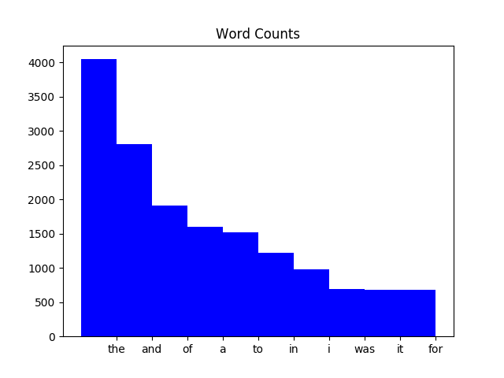

Usage
=====

How to clone the code
---------------------

You can clone the code by doing:

::

  $ git clone https://github.com/coderefinery/word-count.git

Make
----

Generate all results:

::

  $ make -f Makefile_all

Snakemake
---------

We create a file called "Snakefile" with the following contents:

::

  # Count words.
  rule count_words:
      input: 'data/isles.txt'
      output: 'processed_data/isles.dat'
      shell: 'python source/wordcount.py data/isles.txt processed_data/isles.dat'
      
and run it with

::

  $ snakemake

Where to find the results
-------------------------

Plots will be written into the result directory.

After you ran the code, you find the results in "results/results.txt".
Example output:

::

  Book		First	Second	Ratio
  abyss		4044	2807	1.44
  isles		3822	2460	1.55
  last		12244	5566	2.20
  sierra	4242	2469	1.72